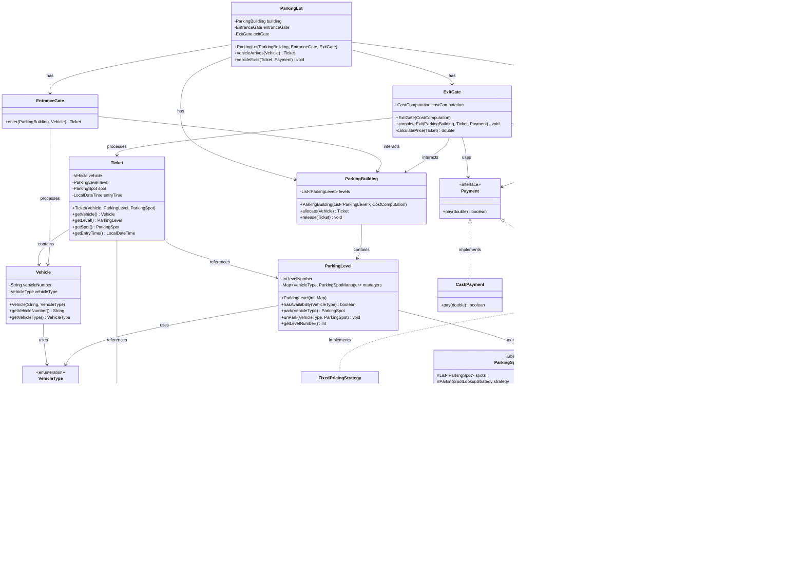

# Parking Lot System

## Entities Identification

1. Entry Gate -> Look for the spot -> If multiple gates check for locking
2. Exit Gate -> Cost Computation -> Can be Card, Cash, UPI
3. Building 3.1 Level 1 -> Only for 2 wheelers, 4 wheelers 3.2 Level 2 -> Only for 4 wheelers and Long Vehicles
4. Vehicle -> vehicleNumber , type (TWO_WHEELER, FOUR_WHEELER)
5. Ticket -> entryTime, vehicle, spot, level
6. Parking Spot -> spotId, isFree
7. Payment -> Cash, Card, Online

8. ParkingSpotManager -> Can be TWO_WHEELER manager or FOUR_WHEELER.

## Design Patterns Used

### 1. **Strategy Pattern**

- **ParkingSpotLookupStrategy**: Allows different algorithms for selecting parking spots (e.g., Random, Nearest, etc.)
- **PricingStrategy**: Enables flexible pricing models (e.g., Fixed, Hourly, Dynamic)
- **Payment**: Supports multiple payment methods (Cash, UPI, etc.)

### 2. **Factory Pattern (Implicit)**

- Different `ParkingSpotManager` implementations for different vehicle types

### 3. **Composition Pattern**

- `ParkingLot` is composed of `ParkingBuilding`, `EntranceGate`, and `ExitGate`
- `ParkingBuilding` contains multiple `ParkingLevel` instances
- `ParkingLevel` manages multiple `ParkingSpotManager` instances

### 4. **Template Method Pattern (Implicit)**

- `ParkingSpotManager` provides common functionality with thread-safe operations
- Subclasses (`TwoWheelerSpotManager`, `FourWheelerSpotManager`) specialize for vehicle types

## Key Features

### Thread Safety

- `ParkingSpotManager` uses `ReentrantLock` to ensure thread-safe parking operations

### Separation of Concerns

- **Entity**: Core domain objects (`Vehicle`, `ParkingSpot`)
- **Parking Lot**: Main system components
- **Spot Managers**: Manage parking spots by vehicle type
- **Lookup Strategy**: Spot selection algorithms
- **Pricing**: Cost calculation logic
- **Payment**: Payment processing

### Extensibility

- Easy to add new vehicle types by creating new `ParkingSpotManager` subclasses
- New pricing strategies can be added by implementing `PricingStrategy`
- New payment methods via `Payment` interface
- New spot selection algorithms via `ParkingSpotLookupStrategy`

## System Flow

1. **Vehicle Entry**:
    - Vehicle arrives → `ParkingLot.vehicleArrives()`
    - `EntranceGate.enter()` → `ParkingBuilding.allocate()`
    - Find available level → Get appropriate `ParkingSpotManager`
    - Select spot using `ParkingSpotLookupStrategy`
    - Return `Ticket` with entry time

2. **Vehicle Exit**:
    - Vehicle exits → `ParkingLot.vehicleExits()`
    - `ExitGate.completeExit()` → Calculate cost using `CostComputation`
    - Process payment via `Payment` interface
    - Release spot → `ParkingBuilding.release()`

## Class Diagram

